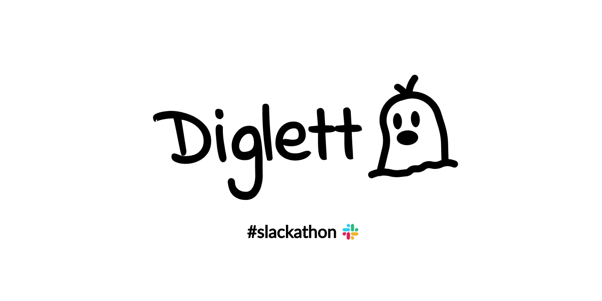

  

<h1>Diglett</h1>

A Slack agent that diagnoses GitHub Actions failures in the thread where they're being discussed.

## What it does

Mention `@diglett` in a thread under a pipeline failure notification. It finds the GitHub Actions run URL, fetches the failed job logs, and lets Claude investigate with tools for repository files, releases, Docker Hub tags, and Slack RTS search - then posts a compact diagnosis card with the likely cause and next steps.

## Quick Start

1. [Add Diglett to your Slack workspace](#)
2. Invite it to a channel: `/invite @Diglett`
3. Reply in any thread containing a GitHub Actions run URL: `@diglett why did this fail?`

## Docs

- [Self-hosting & configuration](docs/setup.md)
